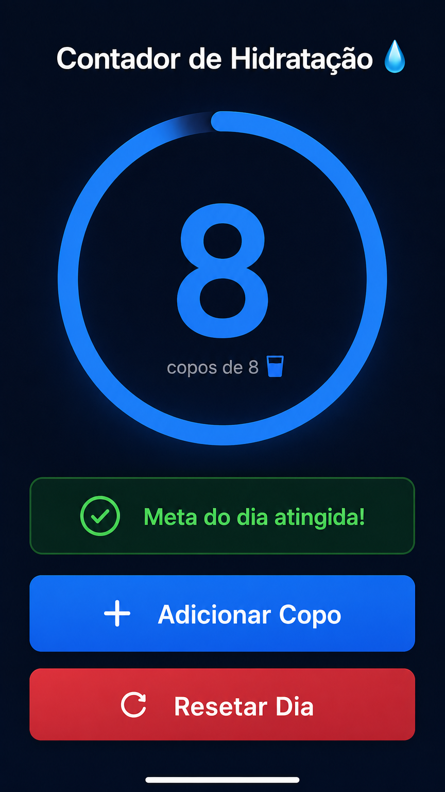
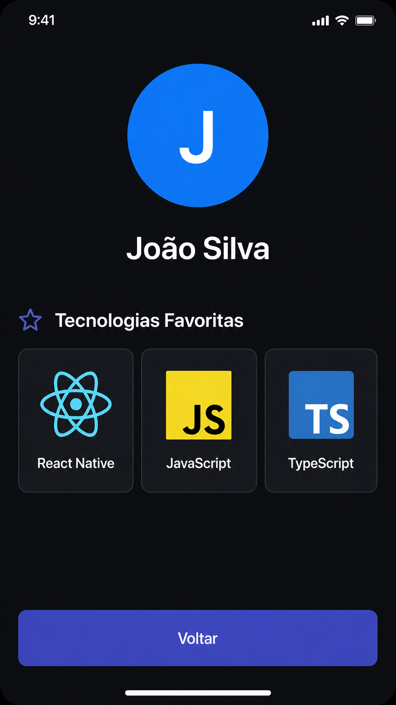
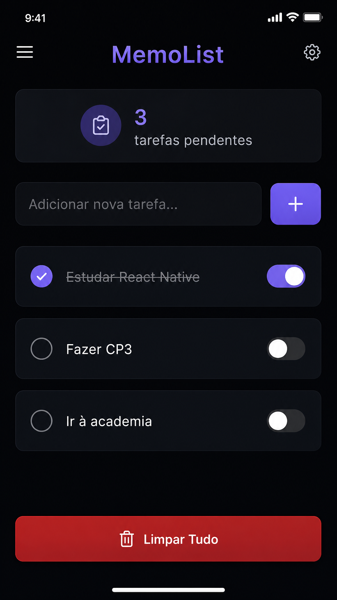
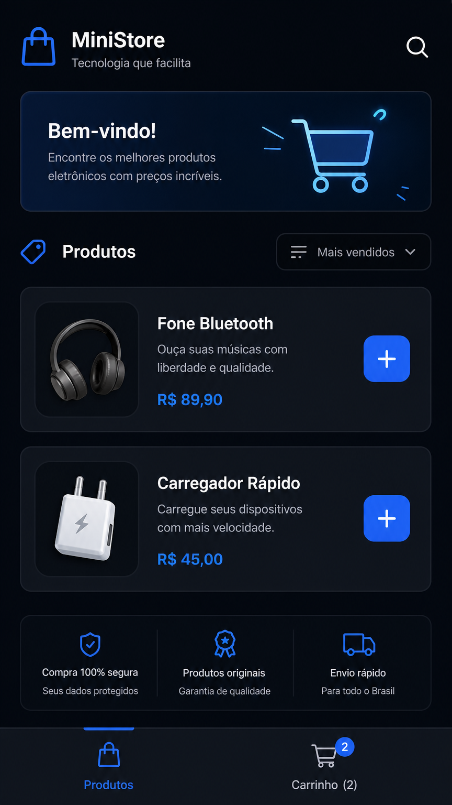
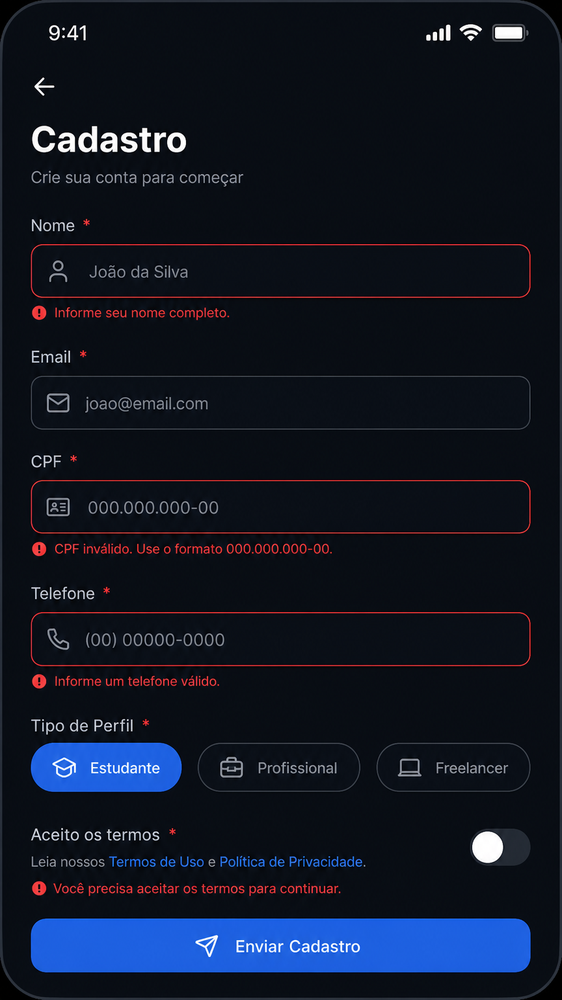

# Checkpoint 3 - Mobile Development & IOT

Este repositório contém os exercícios práticos desenvolvidos ao longo da disciplina de Mobile Development & IOT, como parte do Checkpoint 3.

## a) Identificação

- **Nome Completo**: Gabriel Galerani Almeida
- **RM**: 557421
- **Turma**: 3ESPF

## b) Índice de Exercícios

Abaixo está uma tabela com todos os exercícios, linkando para cada pasta:

| Aula | Exercício | Pasta |
|------|-----------|-------|
| 03   | Cartão de Visita Digital | [aula03-cartao-visita](./aula03-cartao-visita/) |
| 04   | Contador de Hidratação   | [aula04-contador-hidratacao](./aula04-contador-hidratacao/) |
| 05   | Meu Perfil               | [aula05-meu-perfil](./aula05-meu-perfil/) |
| 06   | MemoList                 | [aula06-memolist](./aula06-memolist/) |
| 07   | Mini Loja                | [aula07-mini-loja](./aula07-mini-loja/) |
| 09   | Cadastro Completo        | [aula09-cadastro-completo](./aula09-cadastro-completo/) |

## c) Como Rodar Cada Projeto

Para rodar qualquer um dos exercícios localmente, siga os passos abaixo:

1.  **Clone o repositório:**
    ```bash
    git clone https://github.com/usuario/fiap-mdi-cp3
    ```
    *(Substitua `https://github.com/usuario/fiap-mdi-cp3` pelo URL real do seu repositório)*

2.  **Navegue até a pasta do exercício desejado:**
    ```bash
    cd fiap-mdi-cp3/aulaXX-nome-do-exercicio
    ```
    *(Substitua `aulaXX-nome-do-exercicio` pela pasta do exercício, por exemplo, `aula03-cartao-visita`)*

3.  **Instale as dependências:**
    ```bash
    npm install
    ```

4.  **Inicie o aplicativo Expo:**
    ```bash
    npx expo start
    ```
    Isso abrirá o Metro Bundler no seu navegador. Você pode então escolher rodar o aplicativo em um emulador, dispositivo físico (usando o aplicativo Expo Go) ou no navegador (se configurado).

## d) Demonstração Visual

### Aula 03 — Cartão de Visita Digital

App de apresentação pessoal, funcionando como um mini Linktree. Demonstra a utilização de componentes básicos, estilização com `StyleSheet`, e a inclusão de imagens remotas via URI. Inclui links interativos para perfis sociais.


### Aula 04 — Contador de Hidratação

App simples para rastreamento de consumo de água. Pratica o uso de `useState` para controlar o contador de copos, `useEffect` para detectar quando a meta diária de 8 copos é atingida, e estilização com `StyleSheet` para um visual moderno e escuro.



### Aula 05 — Meu Perfil

Mini-aplicativo com duas telas e navegação entre elas. Explora o conceito de navegação básica em React Native, exibindo informações do usuário e tecnologias favoritas em um layout flexível com `Flexbox`.



### Aula 06 — MemoList

Evolução de um aplicativo de lista de tarefas com persistência de dados. Utiliza `AsyncStorage` para salvar o estado das tarefas (concluídas ou pendentes) e permite limpar todas as tarefas, além de exibir um contador de tarefas pendentes.



### Aula 07 — Mini Loja

Mini loja virtual que demonstra o gerenciamento de estado global com `Context API` e a utilização de dados mockados para produtos. Permite adicionar itens ao carrinho, alterar quantidades e visualizar o total, com navegação entre a tela de produtos e o carrinho.



### Aula 09 — Cadastro Completo

Aplicativo de cadastro completo com máscaras de entrada e validação avançada de formulários. Inclui campos para nome, e-mail, CPF e telefone com máscaras, seleção de perfil via chips, switch para aceite de termos e feedback de validação inline.



## e) Reflexão Final (Opcional)

[Escreva aqui sua reflexão sobre a disciplina, desafios, aprendizados e o que levaria para projetos futuros.]

## 🌟 Diferencial (Opcional)

[Documente aqui quaisquer diferenciais implementados, como desafios bônus, estilização acima da média, funcionalidades extras ou refatorações com boas práticas.]
